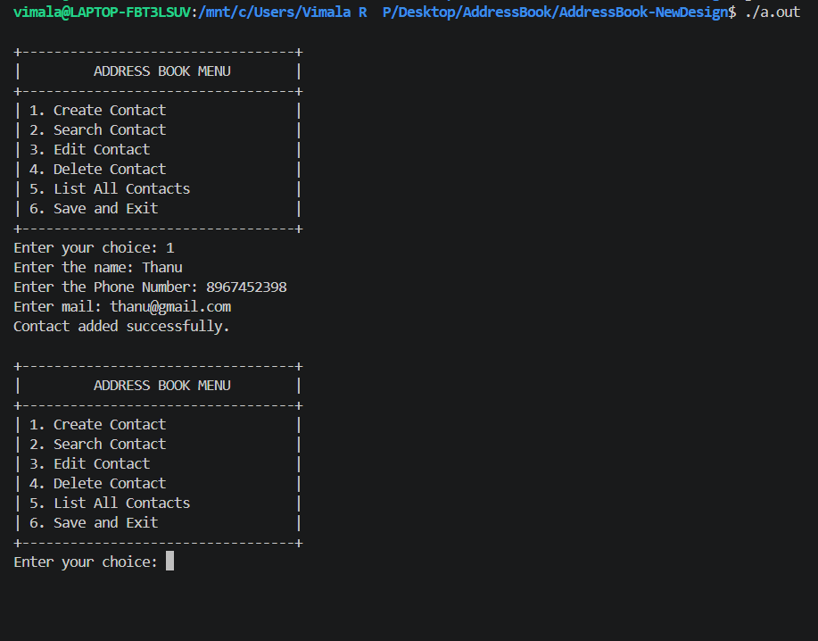
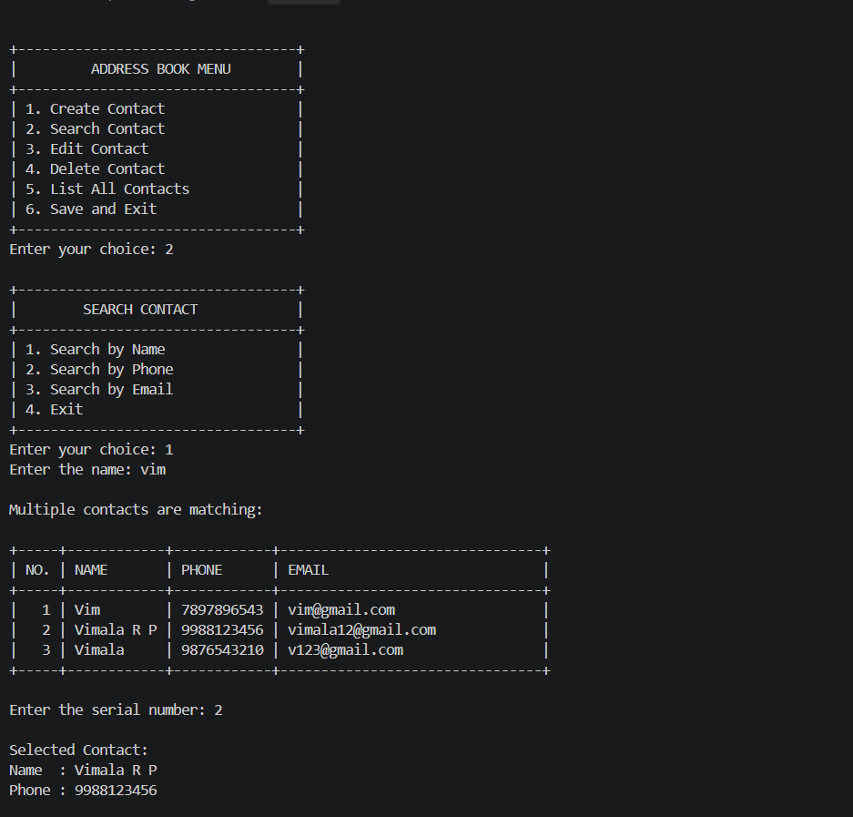
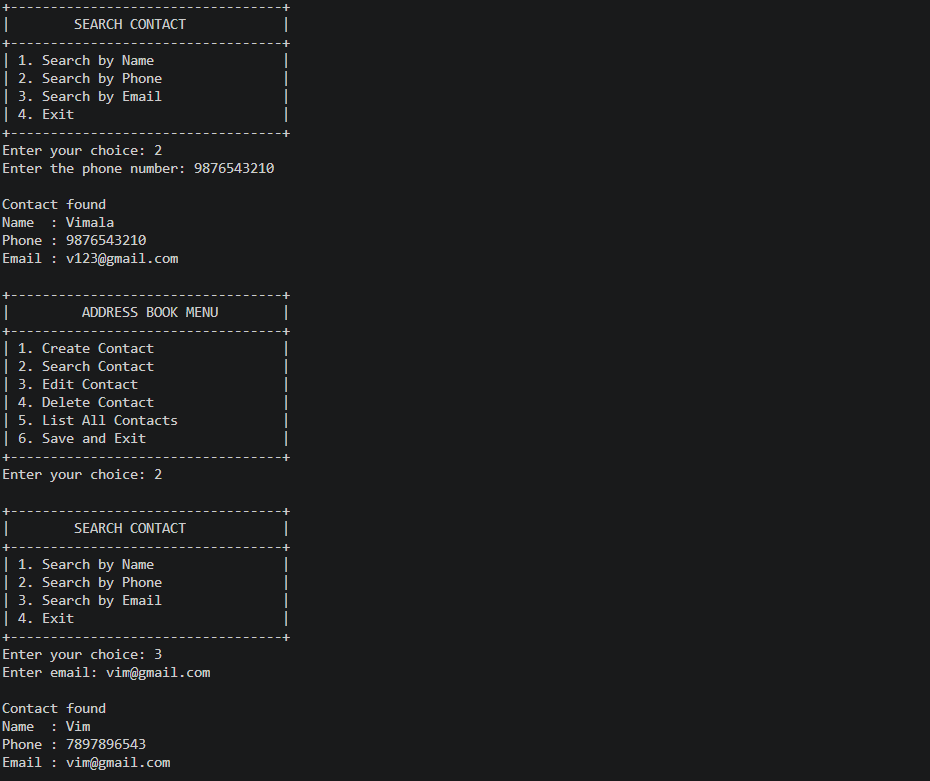
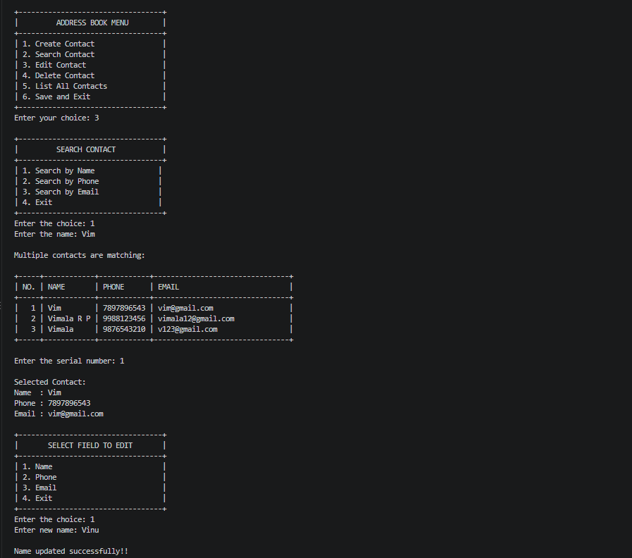
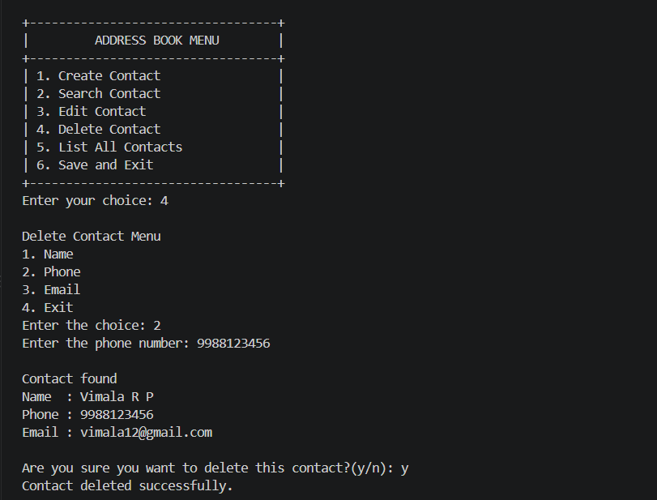
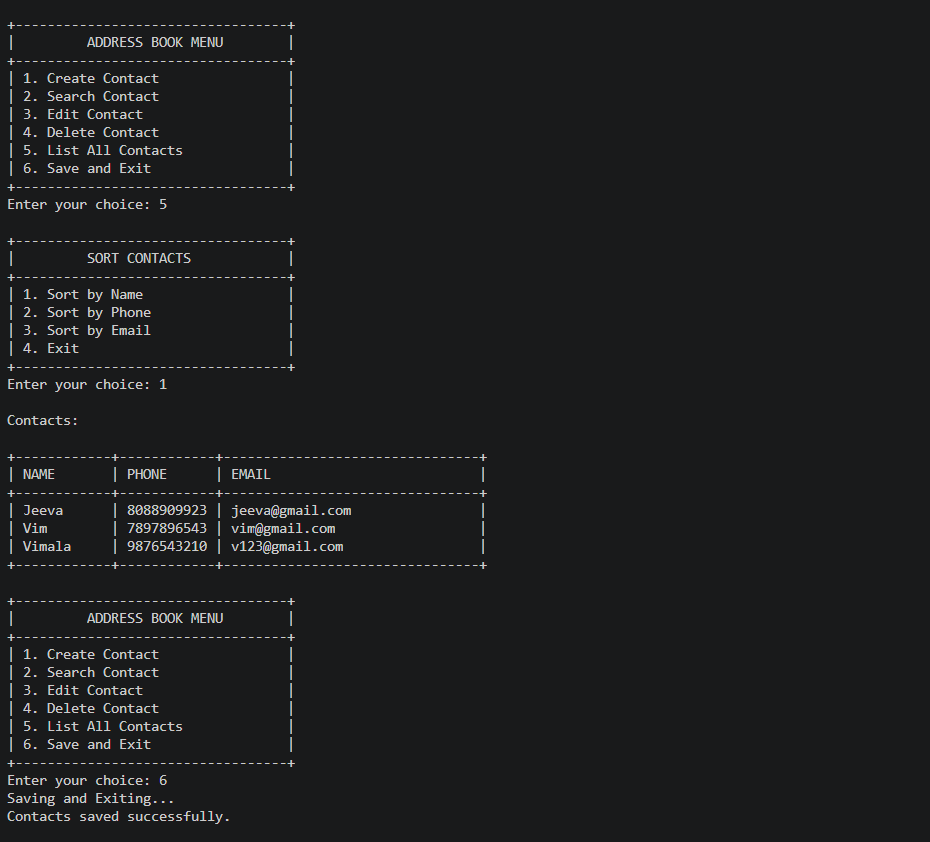
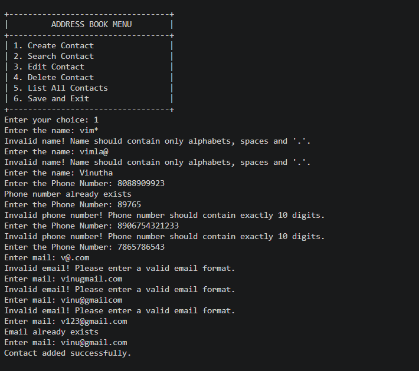

# 📒 Address Book Management System

A **modular, menu-driven Address Book Management System developed in C** for creating, searching, editing, deleting, sorting, and storing contact information using **structures, arrays, functions, pointers, searching, sorting, validation, and file I/O**.

---

## 🚀 Project Overview

This project demonstrates how core **C programming concepts** can be combined to build a complete data-driven application.

The application manages contact records and provides persistent storage using a CSV file.

### Main Operations

* ➕ Create Contact
* 🔍 Search Contact
* ✏️ Edit Contact
* 🗑️ Delete Contact
* 📋 List All Contacts
* 🔤 Sort Contacts
* 💾 Save and Exit

---

## ✨ Key Features

### 🔍 Contact Search

Supports:

* Partial name search
* Case-insensitive name search
* Phone number search
* Email search
* Multiple matching contacts with user selection

For example, searching:

```text
vim
```

can display multiple matching contacts, allowing the user to select the required contact.

---

### 🔤 Sorting

Contacts can be sorted using **Bubble Sort** based on:

* Name
* Phone number
* Email

Example:

```text
Before:

Vimala R P
Jeeva
Vim

After sorting by Name:

Jeeva
Vim
Vimala R P
```

---

### 🛡️ Data Validation

The application validates contact information before storing it.

**Name**

* Allows alphabets
* Allows spaces
* Allows periods

**Phone Number**

* Exactly 10 digits
* Duplicate phone numbers are rejected

**Email Address**

* Valid email format
* Requires `@`
* Requires `.`
* Duplicate email addresses are rejected

---

### 💾 File Handling

Contact information is stored persistently in:

```text
contacts.csv
```

Example:

```text
#3
Vimala R P,9876543210,vimala@gmail.com
Jeeva,9765431290,jeeva@gmail.com
Vim,8098989880,vim@gmail.com
```

The first line stores the total number of contacts.

The application loads the saved contacts when it starts and saves the updated records when the user selects **Save and Exit**.

---

## 🧠 C Programming Concepts

| Area                    | Concepts                                 |
| ----------------------- | ---------------------------------------- |
| **Data Representation** | Structures, Arrays                       |
| **Program Design**      | Functions, Pointers, Modular Programming |
| **String Processing**   | String traversal, comparison, validation |
| **Data Processing**     | Searching, Bubble Sort                   |
| **File Handling**       | File I/O, CSV storage                    |
| **Validation**          | Input validation, Duplicate checking     |

---

## 🧩 Project Structure

```text
AddressBook-C-Project/
│
├── images/
│   ├── create_contact.png
│   ├── delete.png
│   ├── edit.png
│   ├── list_save_exit.png
│   ├── multiple_search.png
│   ├── search_phone_email.png
│   └── validation_phone_email.png
│
├── contact.c
├── contact.h
├── contacts.csv
├── file.c
├── file.h
├── main.c
└── README.md
```

### Module Description

| File           | Responsibility                                         |
| -------------- | ------------------------------------------------------ |
| `main.c`       | Main menu and program flow                             |
| `contact.c`    | Create, search, edit, delete, list and sort operations |
| `contact.h`    | Contact structure, constants and function declarations |
| `file.c`       | Saving and loading contacts                            |
| `file.h`       | File operation declarations                            |
| `contacts.csv` | Persistent contact data                                |

---

## 📦 Contact Structure

The project uses a structure to represent each contact:

```c
typedef struct
{
    char name[50];
    char phone[20];
    char email[50];
} Contact;
```

Maximum contact capacity:

```c
#define MAX_CONTACTS 100
```

---

## 📸 Project Screenshots

### ➕ Create Contact



### 🔍 Multiple Name Search



### 📱 Phone & Email Search



### ✏️ Edit Contact



### 🗑️ Delete Contact



### 📋 List & Save_Exit



### 🛡️ Phone & Email Validation



---

## ⚙️ Build & Run

### 1. Compile

Make sure GCC is installed, then run:

```bash
gcc main.c contact.c file.c -o addressbook
```

### 2. Run

```bash
./addressbook
```

---

## 📊 Technical Specifications

```text
Language             : C
Application Type     : Menu-Driven CLI
Maximum Contacts     : 100
Data Representation  : Structure
Searching            : Partial / Case-Insensitive
Sorting              : Bubble Sort
Storage              : CSV File
File Handling        : Read / Write
```

---

## 🔄 Application Flow

```text
User Input
    ↓
Validation
    ↓
Create / Search / Edit / Delete
    ↓
Sort / List
    ↓
Save
    ↓
contacts.csv
```

---

## 🎯 Project Highlights

* Built a complete **modular C application**
* Used **structures and arrays** to manage contact records
* Implemented **searching and Bubble Sort**
* Added **input validation and duplicate prevention**
* Implemented **CSV-based persistent storage**
* Separated functionality across multiple `.c` and `.h` files
* Designed a menu-driven user interface for managing contacts

---

## 🔗 Repository

**GitHub:**
https://github.com/vimala-rp/AddressBook-C-Project

---

